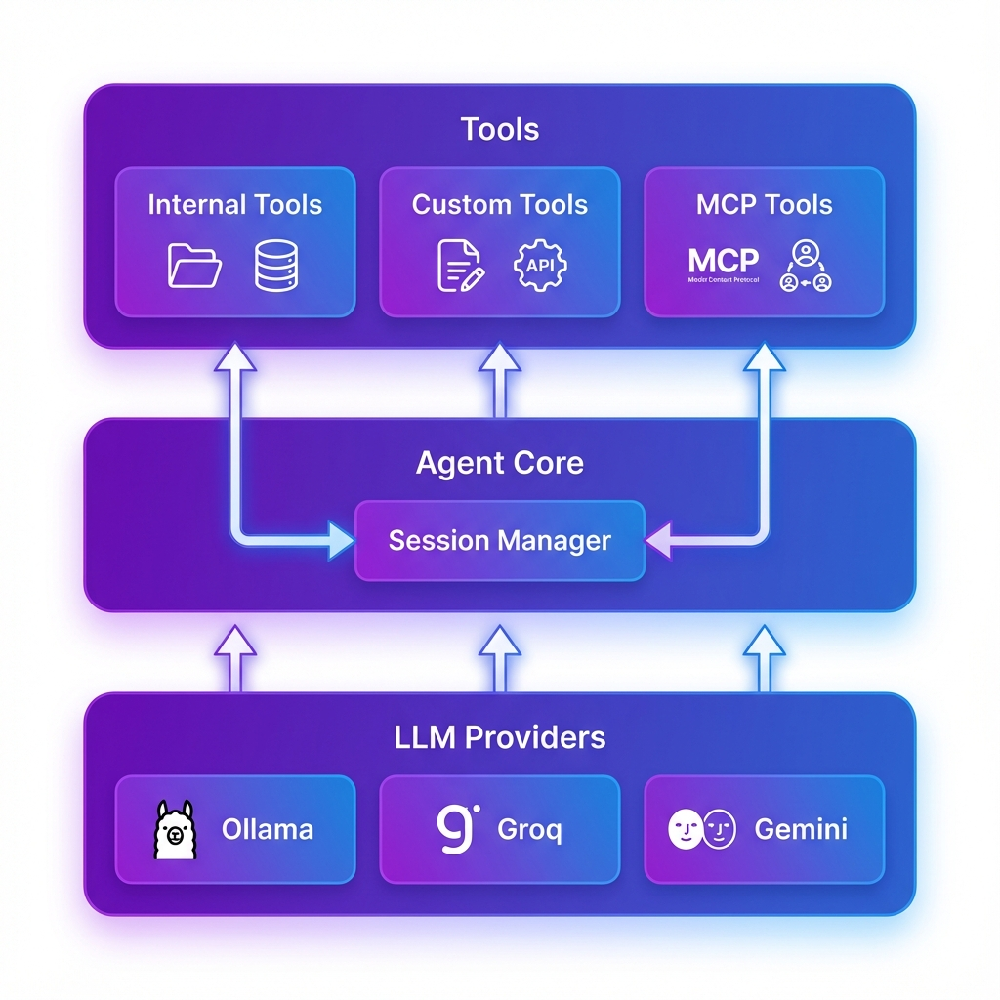

# Scratchy

**A one-stop Python-based solution for understanding how real-world AI agents are built.**

Scratchy is a powerful, modular AI agent framework designed for both **learning** and **production use**. Whether you're a beginner exploring AI agents for the first time or an expert building sophisticated multi-agent systems, Scratchy provides the tools and transparency you need.
.png)


[](LICENSE)

## 🎯 Who is Scratchy For?

### 🌱 Beginners
- **Learn by doing**: See exactly how agents make decisions, use tools, and manage context
- **Clear architecture**: Understand the flow from user input → LLM → tool execution → response
- **Well-documented**: Every component explained with examples
- **Start simple**: Begin with basic agents, gradually add complexity

### 🚀 Intermediate Developers
- **Production-ready**: Session management, error handling, and persistence built-in
- **Extensible**: Easy custom tool creation and MCP integration
- **Multi-provider**: Switch between Ollama, Groq, and Gemini seamlessly
- **Best practices**: Learn industry-standard patterns for agent development

### 🔬 Experts
- **Low-level control**: Direct access to prompts, tool schemas, and execution flow
- **Modular design**: Swap components, customize behavior, extend functionality
- **Research-friendly**: Experiment with different architectures and strategies
- **MCP protocol**: Integrate with the growing ecosystem of MCP servers

## 💡 What Makes Scratchy Different?

Unlike black-box agent frameworks, Scratchy is built for **transparency and education**:

- ✅ **See the internals**: Every decision, tool call, and retry is visible
- ✅ **Understand the flow**: Clear separation between LLM, tools, and session management
- ✅ **Learn by example**: Comprehensive docs showing high-level concepts and low-level implementation
- ✅ **Production-ready**: Not just a learning tool—build real applications



## ✨ Features

- 🤖 **Unified Agent Architecture** - Single `Agent` class supporting internal, MCP, and custom tools
- 💻 **Specialized Copilot** - Pre-configured for coding tasks with context switching
- 📂 **Session Management** - Persistent chat history with `.toon` format
- 🛠️ **Custom Tool Support** - Easy function-to-tool conversion
- 🔌 **MCP Integration** - Connect to external MCP servers
- 🎯 **Multi-Provider** - Ollama, Groq, and Gemini support

## 🚀 Quick Start

```python
import asyncio
from scratchy import Agent

async def main():
    # Initialize agent
    agent = Agent(llm="ollama", model="gpt-oss:20b")
    agent.load_default_tools()
    
    # Chat
    response = await agent.chat("List files in current directory")
    print(response)

asyncio.run(main())
```

## 📦 Installation

```bash
# Clone repository
git clone https://github.com/RudraModi360/Agentry.git
cd Scratchy

# Install dependencies
uv sync  # or: pip install -r requirements.txt
```

## 📚 Learning Path

### Level 1: Understanding Agents (Beginners)
1. **[Getting Started](docs/getting-started.md)** - Install and run your first agent
2. **[Core Concepts](docs/core-concepts.md)** - Learn how agents think and act
3. **[Basic Examples](docs/examples.md#basic-examples)** - Simple use cases

**What you'll learn:**
- How LLMs interact with tools
- The agent decision-making loop
- Session and context management

### Level 2: Building Agents (Intermediate)
1. **[Custom Tools](docs/custom-tools.md)** - Create your own tools
2. **[Session Management](docs/session-management.md)** - Persist conversations
3. **[API Reference](docs/api-reference.md)** - Deep dive into the API

**What you'll learn:**
- Tool schema design
- Error handling and retries
- Multi-session architectures

### Level 3: Advanced Patterns (Expert)
1. **[MCP Integration](docs/mcp-integration.md)** - Connect external tools
2. **Source Code** - Read `scratchy/agents/agent.py` to understand internals
3. **Extend the Framework** - Build custom providers and agents

**What you'll learn:**
- Low-level prompt engineering
- Provider abstraction patterns
- Production deployment strategies

## 🔍 High-Level vs Low-Level Understanding

Scratchy is designed to teach both perspectives:

### 🌐 High-Level (What)
- **What** agents do: Make decisions, use tools, manage context
- **What** makes them useful: Automation, reasoning, integration
- **What** patterns work: ReAct, tool calling, session management

**See it in action:**
```bash
python run_agent.py --debug
# Watch the agent think, plan, and execute
```

### ⚙️ Low-Level (How)
- **How** prompts are constructed: See `scratchy/config/prompts.py`
- **How** tools are executed: See `scratchy/tools/registry.py`
- **How** errors are handled: See `scratchy/agents/agent.py` (chat method)

**Explore the code:**
```python
# See exactly how the agent loop works
from scratchy import Agent
agent = Agent(debug=True)  # Enable detailed logging
```

## 📖 Documentation

- **[Getting Started](docs/getting-started.md)** - Installation and first steps
- **[API Reference](docs/api-reference.md)** - Complete API documentation
- **[Session Management](docs/session-management.md)** - Working with sessions
- **[Custom Tools](docs/custom-tools.md)** - Creating custom tools
- **[Examples](docs/examples.md)** - Code examples and recipes

[**📚 Full Documentation →**](docs/)

## 🎯 Key Capabilities

### Custom Tools

```python
def calculate_bmi(weight_kg: float, height_m: float) -> str:
    """Calculate BMI given weight and height."""
    bmi = weight_kg / (height_m ** 2)
    return f"BMI: {bmi:.2f}"

agent.register_tool_from_function(calculate_bmi)
```

### Session Persistence

```python
# Sessions auto-save to scratchy/session_history/
python run_agent.py --session my_project

# Commands: /status, /sessions, /new, /resume
```

### Copilot Mode

```python
from scratchy import CopilotAgent

copilot = CopilotAgent(llm="ollama")
await copilot.chat("Create a factorial function")
await copilot.general_chat("Tell me a joke")  # Context switch
```

## 🛠️ Built-in Tools

- **Filesystem**: read, create, edit, delete, list, search files
- **Execution**: run shell commands, execute Python code
- **Web**: search, fetch URLs

## 📂 Project Structure

```
Scratchy/
├── scratchy/              # Main package
│   ├── agents/           # Agent implementations
│   ├── providers/        # LLM providers (Ollama, Groq, Gemini)
│   ├── tools/            # Built-in tools
│   ├── config/           # Configuration & prompts
│   ├── session_history/  # Saved sessions (.toon)
│   └── session_manager.py
├── docs/                 # Documentation
├── run_agent.py          # Interactive runner
└── examples/             # Usage examples
```

## 🔧 Configuration

### LLM Providers

```python
# Ollama (local)
Agent(llm="ollama", model="gpt-oss:20b")

# Groq (cloud)
Agent(llm="groq", model="llama-3.3-70b-versatile", api_key="...")

# Gemini (Google)
Agent(llm="gemini", model="gemini-pro", api_key="...")
```

### MCP Integration

Create `mcp.json`:
```json
{
  "mcpServers": {
    "excel": {
      "command": "npx",
      "args": ["-y", "@modelcontextprotocol/server-excel"]
    }
  }
}
```

```python
await agent.add_mcp_server("mcp.json")
```

## 🧪 Testing

```bash
# Run test suite
python test_scratchy_suite.py

# Test commands
python test_commands.py

# Robust agent tests
python check.py
```

## 📝 Interactive Mode

```bash
# Start interactive session
python run_agent.py

# With specific session
python run_agent.py --session my_project

# Copilot mode
python run_agent.py --copilot

# Different provider
python run_agent.py --provider groq --model llama-3.3-70b-versatile
```

### Available Commands

| Command | Description |
|---------|-------------|
| `/help` | Show help |
| `/status` | Show session info |
| `/tools` | List tools |
| `/sessions` | List sessions |
| `/new <id>` | Create session |
| `/resume <id>` | Resume session |
| `/clear` | Clear session |
| `/exit` | Exit (auto-saves) |

## 🎓 Examples

See [docs/examples.md](docs/examples.md) for:
- Basic agent usage
- Custom tool creation
- Session management
- MCP integration
- Multi-agent systems

## 🤝 Contributing

Contributions welcome! Please see [CONTRIBUTING.md](CONTRIBUTING.md).

## 📞 Support

- **Issues**: [GitHub Issues](https://github.com/RudraModi360/Agentry/issues)
- **Discussions**: [GitHub Discussions](https://github.com/RudraModi360/Agentry/discussions)
- **Email**: rudramodi9560@gmail.com

## ❤️ Like & Subscribe

If you like this type of content and find it helpful, please **like and subscribe**! Your support helps us create more educational content about AI agents.

## ⭐ Star History

If you find this project useful, please consider giving it a star! ⭐

## 📄 License

MIT License - see [LICENSE](LICENSE) for details.

## 🙏 Acknowledgments

- [Ollama](https://ollama.ai/) - Local LLM runtime
- [Groq](https://groq.com/) - Fast cloud inference
- [Gemini](https://ai.google.dev/) - Google's AI models
- [TOON Format](https://github.com/toon-format/toon) - Session persistence format
- [Model Context Protocol](https://modelcontextprotocol.io/) - Tool integration standard

**Special Thanks:**
- **Ollama & Groq** for providing generous free tiers and credits to use their cloud-hosted models for testing and development.

---

**Built with ❤️ by [Rudra Modi](mailto:rudramodi9560@gmail.com)**

*Evolving towards the future of voice-driven AI assistants*
