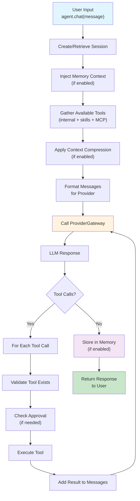
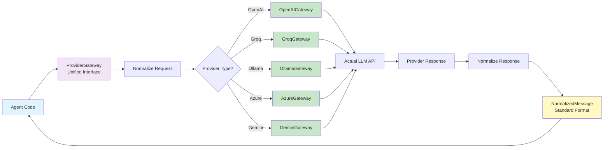
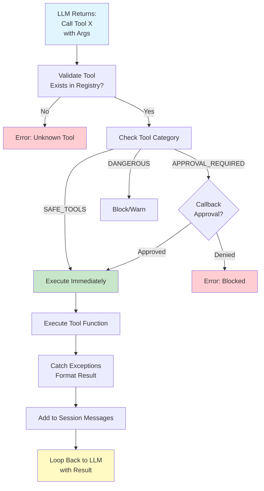
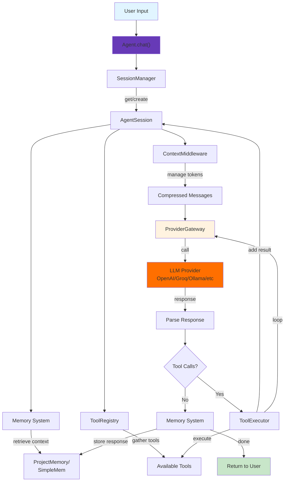

# Core Architecture: How Logicore Works Under the Hood

This section explains **how the pieces work together**. You don't need to read this to use Logicore, but it helps when you're building custom integrations or debugging complex behaviors.

---

## 1. The Agent Execution Loop

Every call to `agent.chat()` follows the same flow. Understanding this is key to grasping everything else.

### **High-Level Flow**



### **Detailed Flow with Code**

```python
# When you call:
response = agent.chat("What's 2 + 2?")

# Logicore does this internally:

# Step 1: Create/retrieve session
session = agent.session_manager.get_or_create(session_id)

# Step 2: Add user message
session.add_message({
    "role": "user",
    "content": "What's 2 + 2?"
})

# Step 3: Inject memory context (if enabled)
if agent.enable_memory:
    relevant_memories = agent.memory.search(
        query="What's 2 + 2?",
        session_id=session.id,
        top_k=3
    )
    # Prepend to system prompt
    system_prompt += f"\nPrevious knowledge:\n{relevant_memories}"

# Step 4: Build message list for LLM
messages = [
    {"role": "system", "content": system_prompt},
    {"role": "user", "content": "What's 2 + 2?"}
]

# Step 5: Get all available tools
tools = [
    agent.tools["calculator"],
    agent.tools["web_search"],
    # ... all loaded tools
]

# Step 6: Call provider gateway
response = await agent.provider_gateway.chat(
    messages=messages,
    tools=tools,
    stream=False
)

# Step 7: Check for tool calls
if response.tool_calls:
    for tool_call in response.tool_calls:
        # Execute the tool
        tool_name = tool_call.function.name
        tool_args = tool_call.function.arguments
        
        # Check approval if needed
        if agent.on_tool_approval:
            approved = agent.on_tool_approval(tool_name, tool_args)
            if not approved:
                result = "Tool execution denied by approval handler"
            else:
                result = agent.execute_tool(tool_name, tool_args)
        
        # Add result back to messages
        session.add_message({
            "role": "assistant",
            "content": "",
            "tool_calls": [tool_call]
        })
        session.add_message({
            "role": "tool",
            "tool_call_id": tool_call.id,
            "content": result
        })
    
    # Loop back to step 6 (call LLM again with tool results)
else:
    # No tool calls, we have final response
    session.add_message({
        "role": "assistant",
        "content": response.content
    })

# Step 8: Store in memory (if enabled)
if agent.enable_memory:
    agent.memory.store(
        session_id=session.id,
        query="What's 2 + 2?",
        response=response.content
    )

# Step 9: Return to user
return response.content
```

### **Key Properties of This Flow**

1. **Stateless Between Calls**: Each `chat()` call is independent—uses session history only
2. **Tool Loop**: LLM → Tools → LLM → Tools until no more tools (or max iterations hit)
3. **Memory is Optional**: Works with or without persistent memory
4. **Provider Agnostic**: Same flow regardless of LLM provider

---

## 2. The Provider Gateway Pattern

Logicore abstracts LLM providers behind a `ProviderGateway`. This is why you can swap providers with one line.

### **Why This Exists**

Each LLM has different APIs:

```python
# OpenAI style
response = client.chat.completions.create(
    model="gpt-4",
    messages=[{"role": "user", "content": "..."}],
    tools=[{"type": "function", "function": {...}}]
)

# Groq style (slightly different)
response = client.chat.completions.create(
    model="mixtral-8x7b",
    messages=[...],
    tools=[{"type": "function", "function": {...}}]
)

# Ollama style (completely different)
response = client.generate(
    model="qwen",
    prompt="...",
    # No native tool support!
)

# Azure style (needs auth headers, different endpoint)
response = client.chat.completions.create(
    model="deployment-name",
    messages=[...],
    api_version="2024-01-01"
)
```

**Problem**: If you have provider-specific code scattered everywhere, switching LLMs is painful.

**Solution**: Standardize on one interface.

### **The Gateway Architecture**



### **How It Works: Example with OpenAI**

```python
class ProviderGateway:
    async def chat(self, messages, tools=None, **kwargs):
        # 1. Normalize request to provider format
        provider_request = self.normalize_request(messages, tools)
        
        # 2. Call actual provider
        provider_response = await self.provider.chat(provider_request)
        
        # 3. Normalize response back
        normalized_response = self.normalize_response(provider_response)
        
        # 4. Return standard format
        return NormalizedMessage(
            content=normalized_response.content,
            tool_calls=normalized_response.tool_calls,
            usage=normalized_response.usage
        )

class OpenAIGateway(ProviderGateway):
    def normalize_request(self, messages, tools):
        """Convert standard format to OpenAI format"""
        return {
            "model": self.model,
            "messages": messages,  # Already correct format
            "tools": [
                {
                    "type": "function",
                    "function": {
                        "name": tool.name,
                        "description": tool.description,
                        "parameters": tool.schema
                    }
                }
                for tool in tools
            ] if tools else None
        }
    
    def normalize_response(self, response):
        """Convert OpenAI response to standard format"""
        tool_calls = []
        if response.tool_calls:
            for tool_call in response.tool_calls:
                tool_calls.append(ToolCall(
                    id=tool_call.id,
                    function_name=tool_call.function.name,
                    arguments=json.loads(tool_call.function.arguments)
                ))
        
        return NormalizedMessage(
            content=response.choices[0].message.content or "",
            tool_calls=tool_calls,
            usage=Usage(
                input_tokens=response.usage.prompt_tokens,
                output_tokens=response.usage.completion_tokens
            )
        )

class OllamaGateway(ProviderGateway):
    """Ollama doesn't support tools natively"""
    
    def normalize_request(self, messages, tools):
        # No tool support, but add tool info to prompt
        prompt = self._format_messages_as_text(messages)
        if tools:
            prompt += "\nAvailable tools:\n"
            for tool in tools:
                prompt += f"- {tool.name}: {tool.description}\n"
        
        return {"model": self.model, "prompt": prompt}
    
    def normalize_response(self, response):
        # Parse tool calls from text if needed
        tool_calls = self._extract_tool_calls_from_text(response.text)
        
        return NormalizedMessage(
            content=response.text,
            tool_calls=tool_calls,
            usage=Usage(
                input_tokens=response.prompt_tokens,
                output_tokens=response.completion_tokens
            )
        )
```

### **Key Insight: It's an Adapter Pattern**

```python
# You never touch provider-specific code
agent = BasicAgent(provider="openai")

# Same code works with any provider:
agent = BasicAgent(provider="groq")
agent = BasicAgent(provider="ollama")

# Because the gateway adapts each provider to a standard interface
```

---

## 3. The Memory System Architecture

Memory allows agents to learn across conversations.

### **Design: Vector + Semantic Search**

```
Conversation 1:
User: "I work on Python projects"
Agent: "Great, Python is excellent..."
    ↓ STORE
Conversation 2:
User: "What's my domain?"
    ↓ SEARCH (semantic)
    ↓ RETRIEVE (similar past context)
    ↓ INJECT + LLM
Agent: "You mentioned you work on Python projects..."
```

### **Under the Hood: SimpleMem Vector Store**

```python
class ProjectMemory:
    def __init__(self):
        self.vector_store = SimpleMem()  # LanceDB-based
        self.embedding_model = EmbeddingModel()
    
    def store(self, session_id: str, query: str, response: str):
        """Store a conversation turn"""
        
        # 1. Generate embedding (convert text to numbers)
        embedding = self.embedding_model.embed(query + " " + response)
        
        # 2. Store with metadata
        self.vector_store.add({
            "session_id": session_id,
            "query": query,
            "response": response,
            "embedding": embedding,
            "timestamp": datetime.now(),
            "tags": extract_tags(query)  # Auto-extract topics
        })
    
    def search(self, session_id: str, query: str, top_k: int = 3):
        """Retrieve relevant past context"""
        
        # 1. Create embedding for search query
        query_embedding = self.embedding_model.embed(query)
        
        # 2. Find similar memories
        results = self.vector_store.search(
            embedding=query_embedding,
            filters={"session_id": session_id},  # Only this session
            limit=top_k
        )
        
        # 3. Return formatted results
        return "\n".join([
            f"Previous: {r.query} → {r.response}"
            for r in results
            if r.similarity > 0.7  # Relevance threshold
        ])
```

### **Memory Lifecycle**

```
┌─────────────────────────────────┐
│   Conversation 1                │
│  Q: "I use Python"              │
│  A: "Cool, I'll remember that"  │
└─────────────────────────────────┘
           ↓ STORE
┌─────────────────────────────────┐
│   Vector Store (LanceDB)        │
│  - Query embedding: [0.2, 0.5...│
│  - Response embedding: [0.3...  │
│  - Session ID, timestamp, tags  │
└─────────────────────────────────┘
           
After 7 days (4000+ new memories):
┌─────────────────────────────────┐
│   Context Window Check          │
│  - Conversation getting long?   │
│  - > 60% of token budget used?  │
└─────────────────────────────────┘
           ↓ COMPRESS
┌─────────────────────────────────┐
│  Summarize old memories         │
│  Keep recent ones               │
│  Resync vector store            │
└─────────────────────────────────┘
```

### **Multi-User Isolation: Session Keys**

```python
# Each session is completely isolated

Session 1 (User A):
memory.store(session_id="session_1", query="...", response="...")

Session 2 (User B):
memory.store(session_id="session_2", query="...", response="...")

# When Agent A searches:
memories = memory.search(
    session_id="session_1",  # Only gets Session 1's memories
    query="..."
)

# When Agent B searches:
memories = memory.search(
    session_id="session_2",  # Only gets Session 2's memories
    query="..."
)

# No cross-talk, no data leaks
```

---

## 4. The Tool Execution Pipeline

When an agent calls a tool, multiple things happen under the hood.

### **Execution Flow**



### **Tool Resolution Order**

When the agent needs to call a tool named `analyze_code`:

```python
def execute_tool(self, tool_name: str, args: dict):
    tool = None
    
    # 1. Check custom tool executors first
    if tool_name in self.custom_tool_executors:
        return self.custom_tool_executors[tool_name](**args)
    
    # 2. Check skill tool executors
    for skill in self.loaded_skills:
        if tool_name in skill.tool_executors:
            return skill.tool_executors[tool_name](**args)
    
    # 3. Check tool registry
    if tool_name in self.tool_registry.tools:
        tool = self.tool_registry.tools[tool_name]
        return tool.execute(**args)
    
    # 4. Check MCP servers
    for mcp_server in self.mcp_servers:
        if tool_name in mcp_server.tools:
            return mcp_server.call_tool(tool_name, args)
    
    # 5. Not found
    raise ToolNotFoundError(f"Unknown tool: {tool_name}")
```

**Key insight**: Tools are resolved in priority order. Custom executors override everything.

### **Error Handling**

```python
def execute_tool(self, tool_name: str, args: dict, attempt=1):
    try:
        # Execute the tool
        result = self._find_and_run_tool(tool_name, args)
        return result
    
    except ToolNotFoundError:
        # LLM hallucinated a tool
        return f"Error: Unknown tool '{tool_name}'"
    
    except ValueError as e:
        # Wrong arguments
        return f"Error: Invalid arguments - {e}"
    
    except TimeoutError:
        # Tool took too long
        return f"Error: Tool timed out after 30s"
    
    except Exception as e:
        # Unexpected error
        if attempt < 3:
            # Retry
            return self.execute_tool(tool_name, args, attempt + 1)
        else:
            # Give up, tell LLM
            return f"Error: Tool failed repeatedly - {e}"
```

---

## 5. Session Management

Sessions isolate conversations and maintain state.

### **Session Structure**

```python
class AgentSession:
    id: str  # Unique session ID
    messages: List[Message]  # Full conversation history
    metadata: Dict  # Custom data
    created_at: datetime
    
    def add_message(self, role: str, content: str, tool_calls=None):
        """Add a message to this session"""
        self.messages.append(Message(
            role=role,
            content=content,
            tool_calls=tool_calls,
            timestamp=datetime.now()
        ))
    
    def get_conversation(self, limit: int = None):
        """Get last N messages for LLM context"""
        messages = self.messages
        if limit:
            messages = messages[-limit:]
        return messages
    
    def clear(self):
        """Reset session (forget conversation)"""
        self.messages = []
```

### **Multi-Session Example**

```python
# Create two completely isolated sessions
session_1 = SessionManager.create_session("user_1")
session_2 = SessionManager.create_session("user_2")

# User 1
agent_1 = Agent(session_id=session_1.id)
agent_1.chat("I work on finance")
agent_1.chat("What's my domain?")  # Returns "finance"

# User 2
agent_2 = Agent(session_id=session_2.id)
agent_2.chat("I work on gaming")
agent_2.chat("What's my domain?")  # Returns "gaming"

# Sessions never interfere
# Even though both use the same Agent class
```

### **Session Persistence**

```python
# Sessions can be:
# 1. In-memory (default, lost when app stops)
session = SessionManager.create_session("test")

# 2. Saved to disk
session.save_to_file("sessions/user_1.json")

# 3. Loaded from disk
session = SessionManager.load_from_file("sessions/user_1.json")

# 4. Persisted to database
session.save_to_database(db_connection)
session = SessionManager.load_from_database("session_id_123")
```

---

## 6. The Skill System Architecture

Skills bundle tools together for organization and reusability.

### **Skill Structure**

A skill is a directory with this layout:

```
my_skill/
├── SKILL.md              # Metadata + documentation
├── scripts/
│   ├── analyze.py        # Tool functions
│   └── report.py
├── resources/
│   ├── templates/
│   │   └── report_template.txt
│   └── config/
│       └── defaults.json
└── examples/
    └── example_usage.py
```

### **How Skills Get Loaded**

```python
class SkillLoader:
    def load(self, skill_name: str) -> Skill:
        # 1. Find skill directory
        skill_dir = self._find_skill_directory(skill_name)
        
        # 2. Parse SKILL.md frontmatter
        metadata = self._parse_frontmatter(skill_dir / "SKILL.md")
        
        # 3. Discover tool functions in scripts/
        tools = self._discover_functions(skill_dir / "scripts")
        
        # 4. Create tool schemas from function signatures
        tool_schemas = [
            self._function_to_schema(func)
            for func in tools
        ]
        
        # 5. Create executors for each tool
        tool_executors = {
            func.__name__: func
            for func in tools
        }
        
        # 6. Return loaded Skill
        return Skill(
            name=metadata["name"],
            description=metadata["description"],
            version=metadata["version"],
            tools=tool_schemas,
            tool_executors=tool_executors
        )

# Function signature → tool schema (automatic)
def analyze_code(path: str, language: str) -> str:
    """Analyze code for issues"""
    pass

# Becomes:
{
    "type": "function",
    "function": {
        "name": "analyze_code",
        "description": "Analyze code for issues",
        "parameters": {
            "type": "object",
            "properties": {
                "path": {"type": "string"},
                "language": {"type": "string"}
            },
            "required": ["path", "language"]
        }
    }
}
```

### **Skill Discovery Paths**

Skills are searched in this order:

```python
# 1. Built-in skills (shipped with Logicore)
logicore/skills/defaults/code_review/

# 2. Project skills (.agent/skills/)
.agent/skills/my_custom_skill/

# 3. Workspace skills (_agent/skills/)
_agent/skills/shared_skill/

# First match wins
skill = loader.load("code_review")
# Uses whichever code_review is found first
```

---

## 7. Context Window Management

LLMs have token limits. Logicore manages context automatically.

### **The Problem**

```
Token Budget: 4096 (GPT-3.5)
  ↓
Conversation gets long:
user: "..." (100 tokens)
assistant: "..." (150 tokens)
user: "..." (120 tokens)
assistant: "..." (140 tokens)
... (repeat 20 times)
  ↓
Total: 5200 tokens

ERROR: Context window exceeded!
```

### **The Solution: Context Middleware**

```python
class ContextMiddleware:
    def __init__(self, token_budget=3000):
        self.token_budget = token_budget
    
    async def process_messages(self, messages: List[Message]):
        """Manage context before sending to LLM"""
        
        total_tokens = self.estimate_tokens(messages)
        
        if total_tokens < self.token_budget:
            # All good
            return messages
        
        # Need to compress
        excess = total_tokens - self.token_budget + 500  # Buffer
        
        # Strategy: Keep recent messages, summarize old ones
        keep_recent = messages[-10:]  # Last 10 messages
        summarize_old = messages[:-10]  # Everything else
        
        # Summarize old conversations
        summary = self.summarize(summarize_old)
        
        # Return: [system + summary, recent messages]
        return [
            Message(
                role="system",
                content=f"Previous conversation summary:\n{summary}"
            ),
            *keep_recent
        ]
```

### **Different Strategies**

```python
# Strategy 1: Keep recent messages (default)
# Keep last N messages, summarize rest

# Strategy 2: By importance
# Keep important messages, summarize less important

# Strategy 3: By topic
# Keep messages about current topic, archive others

# Configure per agent:
agent = Agent(
    context_strategy="recent",
    context_window_percentage=0.8,  # Use 80% of available tokens
)
```

---

## 8. Component Interaction Diagram

How everything fits together:



---

## Summary: When You Need This Knowledge

**You don't** need to understand all this to use Logicore. But you'll benefit from knowing:

- **Agent Loop**: When debugging "why isn't my agent acting right?"
- **Provider Gateway**: When adding a new LLM provider
- **Memory System**: When optimizing memory retrieval or debugging "agent forgot"
- **Tool Execution**: When tools aren't working or need complex logic
- **Session Management**: When building multi-user systems
- **Skill System**: When creating reusable skill libraries
- **Context Management**: When hitting token limits

Everything else is optional depth.

---

## Next: Reference Docs

Ready for the exhaustive details? See [05-api-reference.md](05-api-reference.md) for every class, method, and parameter.

Or go back to [03-how-to-guides.md](03-how-to-guides.md) if you need practical examples.
