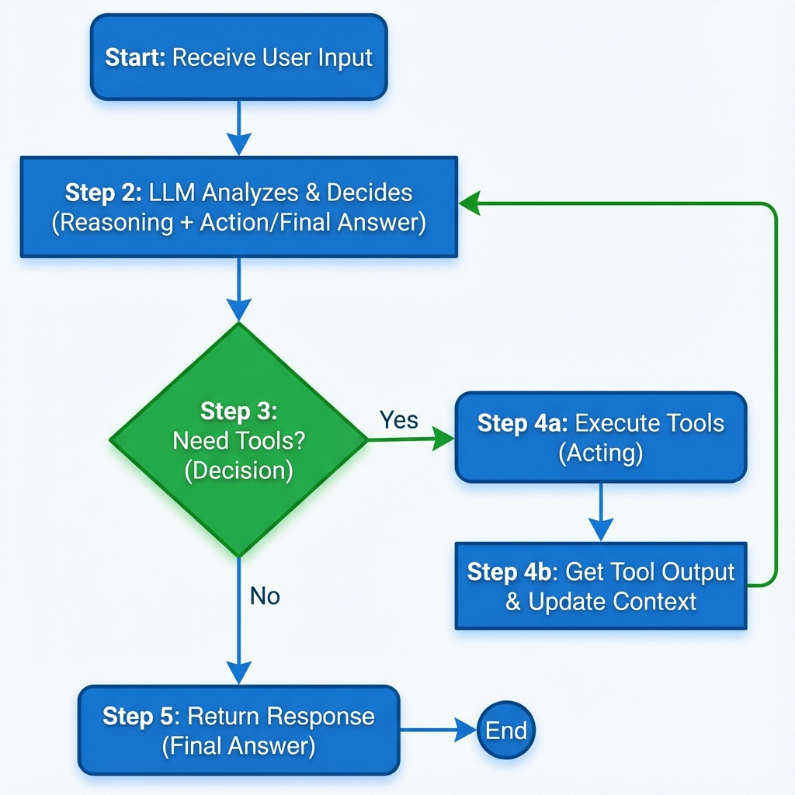
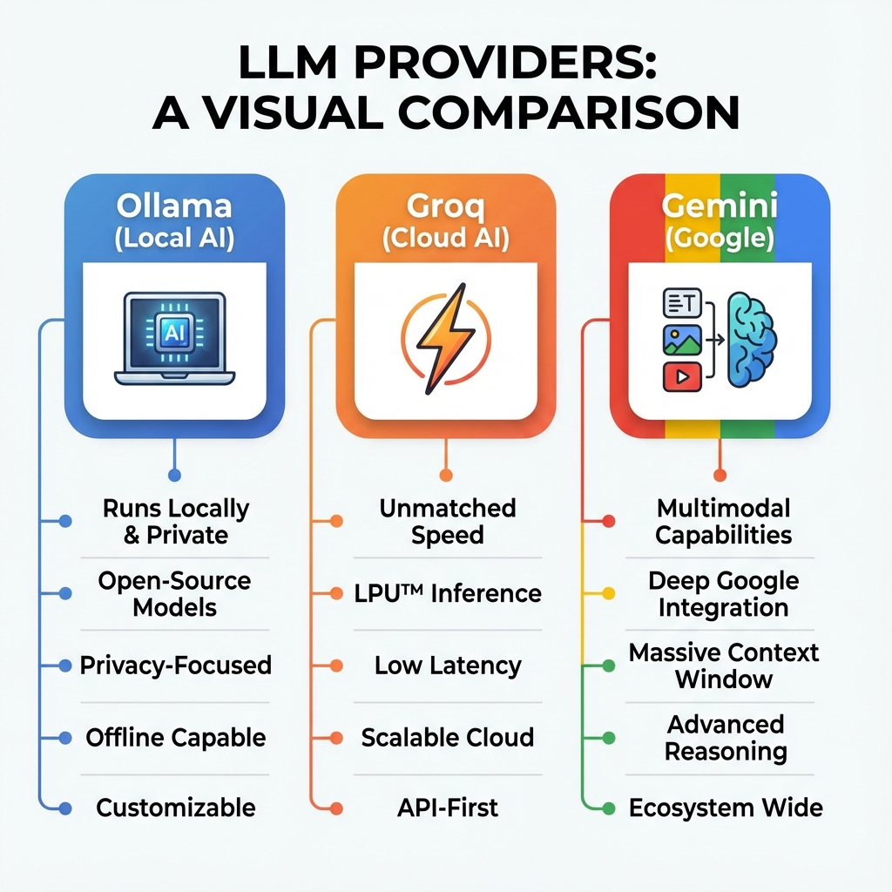
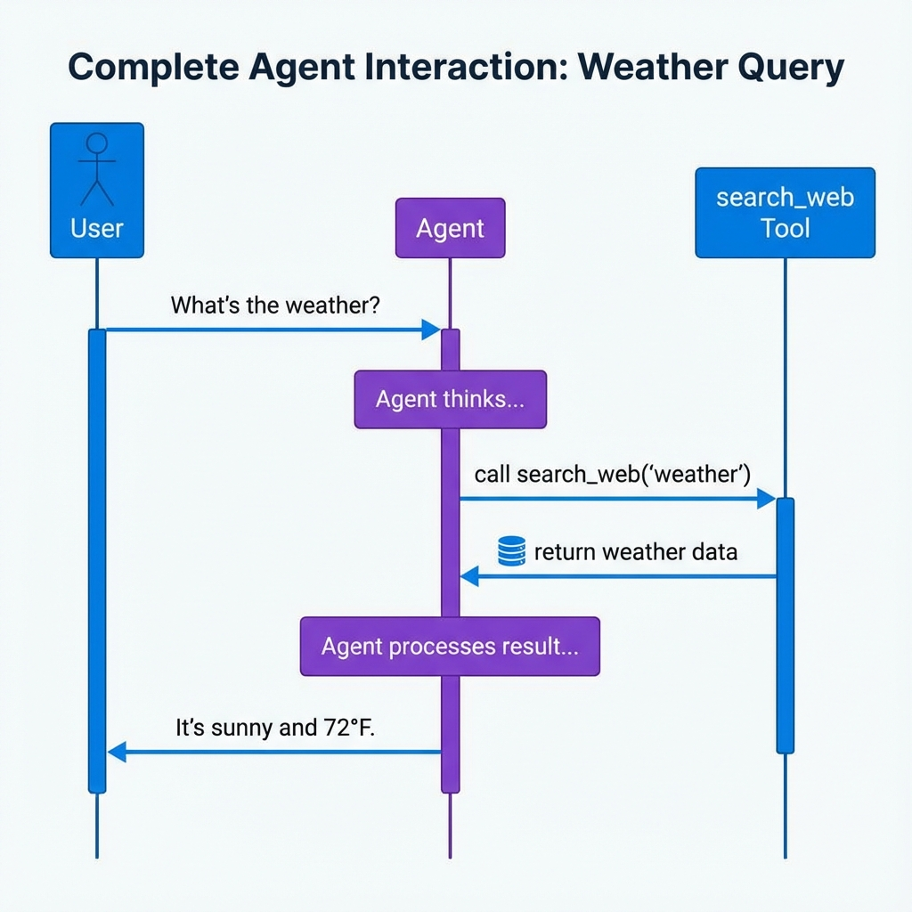

# Core Concepts

Understanding how Scratchy agents work under the hood.

## Table of Contents

- [What is an AI Agent?](#what-is-an-ai-agent)
- [The Agent Loop](#the-agent-loop)
- [Tools and Function Calling](#tools-and-function-calling)
- [Session Management](#session-management)
- [Providers](#providers)
- [MCP Integration](#mcp-integration)

## What is an AI Agent?

An **AI agent** is a system that can:
1. **Perceive** its environment (through user input and context)
2. **Reason** about what actions to take (using an LLM)
3. **Act** on the environment (by calling tools/functions)
4. **Learn** from results (by maintaining conversation history)

Unlike a simple chatbot that only generates text, an agent can **do things** - read files, search the web, execute code, and more.


### Example Flow

```
User: "What's the weather in New York?"
  ↓
Agent thinks: "I need to search the web for this"
  ↓
Agent calls: search_web("weather New York")
  ↓
Tool returns: "72°F, sunny"
  ↓
Agent responds: "The weather in New York is 72°F and sunny!"
```

## The Agent Loop

Scratchy uses a **ReAct** (Reasoning + Acting) pattern:



```python
while not done and iterations < max_iterations:
    # 1. Get LLM response
    response = await llm.chat(messages, tools=available_tools)
    
    # 2. Check if done
    if no tool_calls:
        return response.content  # Final answer
    
    # 3. Execute tools
    for tool_call in response.tool_calls:
        result = execute_tool(tool_call.name, tool_call.args)
        messages.append({"role": "tool", "content": result})
    
    # 4. Loop back to step 1 with updated context
```

### Key Points

- **Iterative**: The agent can call multiple tools in sequence
- **Context-aware**: Each iteration has access to previous results
- **Bounded**: `max_iterations` prevents infinite loops (default: 20)
- **Transparent**: You can see every decision and tool call

## Tools and Function Calling

Tools are functions the agent can call to interact with the world.

### Tool Schema

Every tool has a schema that tells the LLM:
- **Name**: What the tool is called
- **Description**: What it does
- **Parameters**: What inputs it needs

Example:
```python
{
    "type": "function",
    "function": {
        "name": "read_file",
        "description": "Read the contents of a file",
        "parameters": {
            "type": "object",
            "properties": {
                "path": {
                    "type": "string",
                    "description": "Path to the file"
                }
            },
            "required": ["path"]
        }
    }
}
```

### How the LLM Chooses Tools

The LLM:
1. Reads the user's request
2. Looks at available tool schemas
3. Decides which tool(s) to call
4. Generates the arguments in JSON format

### Safety & Permissions

Scratchy includes a built-in safety mechanism for critical operations. Tools can be classified as:
- **Safe**: Read-only operations (e.g., `read_file`, `list_files`)
- **Dangerous**: Destructive or critical operations (e.g., `delete_file`, `git_command`)

When a dangerous tool is called, the agent:
1. Pauses execution
2. Triggers the `on_tool_approval` callback
3. Waits for user confirmation (Yes/No)
4. Executes only if approved

This ensures the agent never performs harmful actions without your consent.

### Built-in Tool Categories

**Filesystem Tools:**
- `read_file` - Read file contents
- `create_file` - Create new files
- `edit_file` - Modify existing files
- `delete_file` - Remove files
- `list_directory` - List directory contents
- `search_files` - Search for files by pattern

**Web Tools:**
- `search_web` - Search the internet
- `fetch_url` - Get content from a URL

**Execution Tools:**
- `run_shell_command` - Execute shell commands
- `execute_python` - Run Python code

## Session Management

Sessions maintain conversation context across multiple interactions.

### Why Sessions Matter

Without sessions:
```python
await agent.chat("My name is Alice")
await agent.chat("What's my name?")  # Agent doesn't remember!
```

With sessions:
```python
await agent.chat("My name is Alice", session_id="user_123")
await agent.chat("What's my name?", session_id="user_123")
# Agent responds: "Your name is Alice"
```

### Session Structure

Each session contains:
- **session_id**: Unique identifier
- **messages**: Full conversation history
- **metadata**: Custom data (timestamps, user info, etc.)
- **created_at**: When the session started
- **last_activity**: Last interaction time

### Session Persistence

Scratchy can save sessions to disk in `.toon` format:

```python
from scratchy.session_manager import SessionManager

manager = SessionManager(storage_dir="./sessions")

# Save
await manager.save_session(agent.get_session("user_123"))

# Load
session = await manager.load_session("user_123")
```

See [Session Management Guide](session-management.md) for details.

## Providers

Providers are adapters that connect Scratchy to different LLM services.

### Available Providers



| Provider | Type | Best For |
|----------|------|----------|
| **Ollama** | Local/Cloud | Development, privacy, no API costs |
| **Groq** | Cloud | Speed, production, low latency |
| **Gemini** | Cloud | Google ecosystem, multimodal |

### Provider Interface

All providers implement the same interface:

```python
class LLMProvider:
    async def chat(
        self,
        messages: List[Dict],
        tools: Optional[List[Dict]] = None
    ) -> Union[Dict, ChatCompletion]:
        """Send messages and get response with optional tool calls."""
        pass
```

This means you can **swap providers** without changing your code:

```python
# Development
agent = Agent(llm="ollama", model="llama3.2")

# Production
agent = Agent(llm="groq", model="llama-3.3-70b-versatile", api_key="...")
```

### Provider-Specific Features

**Ollama:**
- Runs locally
- No API key needed
- Full privacy
- Supports custom models

**Groq:**
- Extremely fast inference
- Pay-per-token pricing
- Requires API key
- Limited model selection

**Gemini:**
- Multimodal support (images, video)
- Google AI integration
- Requires API key
- Advanced reasoning

## MCP Integration

**Model Context Protocol (MCP)** allows Scratchy to connect to external tool servers.

### What is MCP?

MCP is a standard protocol for:
- Exposing tools from external services
- Connecting multiple agents to shared tools
- Building modular, composable AI systems

### How It Works


```
┌─────────────┐
│   Scratchy  │
│    Agent    │
└──────┬──────┘
       │
       ├─── Internal Tools (filesystem, web, etc.)
       │
       └─── MCP Client ──┐
                         │
                    ┌────┴─────┐
                    │ MCP      │
                    │ Servers  │
                    └──────────┘
                         │
                    ┌────┼────┐
                    │    │    │
                  Excel DB  Slack
```

### Using MCP

1. **Create `mcp.json`:**
```json
{
  "mcpServers": {
    "excel": {
      "command": "npx",
      "args": ["-y", "@modelcontextprotocol/server-excel"]
    }
  }
}
```

2. **Connect in your agent:**
```python
agent = Agent(llm="ollama")
await agent.add_mcp_server("mcp.json")
```

3. **Use MCP tools naturally:**
```python
await agent.chat("Read data from sales.xlsx")
# Agent automatically uses the Excel MCP server
```

See [MCP Integration Guide](MCP_AGENT.md) for advanced usage.

## Understanding the Flow

### High-Level View (What happens)



```
User Input
    ↓
Agent receives request
    ↓
Agent thinks (LLM reasoning)
    ↓
Agent decides to use tools OR respond
    ↓
If tools: Execute → Get results → Think again
If response: Return to user
```

### Low-Level View (How it happens)

```
1. User input added to session.messages
2. session.messages sent to provider.chat()
3. Provider calls LLM API with messages + tool schemas
4. LLM returns response (text OR tool_calls)
5. If tool_calls:
   a. Parse tool name and arguments
   b. Check if approval needed
   c. Execute tool via execute_tool()
   d. Add result to session.messages
   e. Go back to step 2
6. If text response:
   a. Add to session.messages
   b. Return to user
```

## Best Practices

### 1. Use Descriptive Tool Names
```python
# Good
def calculate_mortgage_payment(principal, rate, years):
    """Calculate monthly mortgage payment."""
    pass

# Bad
def calc(p, r, y):
    """Do calculation."""
    pass
```

### 2. Provide Clear Descriptions
The LLM uses descriptions to decide when to call tools:
```python
# Good description
"Calculate the monthly mortgage payment given principal amount, annual interest rate, and loan term in years"

# Bad description
"Calculate payment"
```

### 3. Handle Errors Gracefully
```python
def my_tool(arg):
    try:
        result = do_something(arg)
        return {"success": True, "data": result}
    except Exception as e:
        return {"success": False, "error": str(e)}
```

### 4. Use Sessions for Context
```python
# Multi-turn conversation
session_id = "project_123"
await agent.chat("Create a file called app.py", session_id)
await agent.chat("Now add a main function to it", session_id)
# Agent remembers the file from previous message
```

### 5. Enable Debug Mode During Development
```python
agent = Agent(llm="ollama", debug=True)
# Prints detailed logs of every decision and tool call
```

## Next Steps

- **Practice**: Try the [Examples](examples.md)
- **Build**: Create [Custom Tools](custom-tools.md)
- **Deep Dive**: Read the [API Reference](api-reference.md)
- **Advanced**: Explore [MCP Integration](MCP_AGENT.md)

---

**Questions?** Check the [FAQ](README.md#faq) or open an issue on GitHub.
