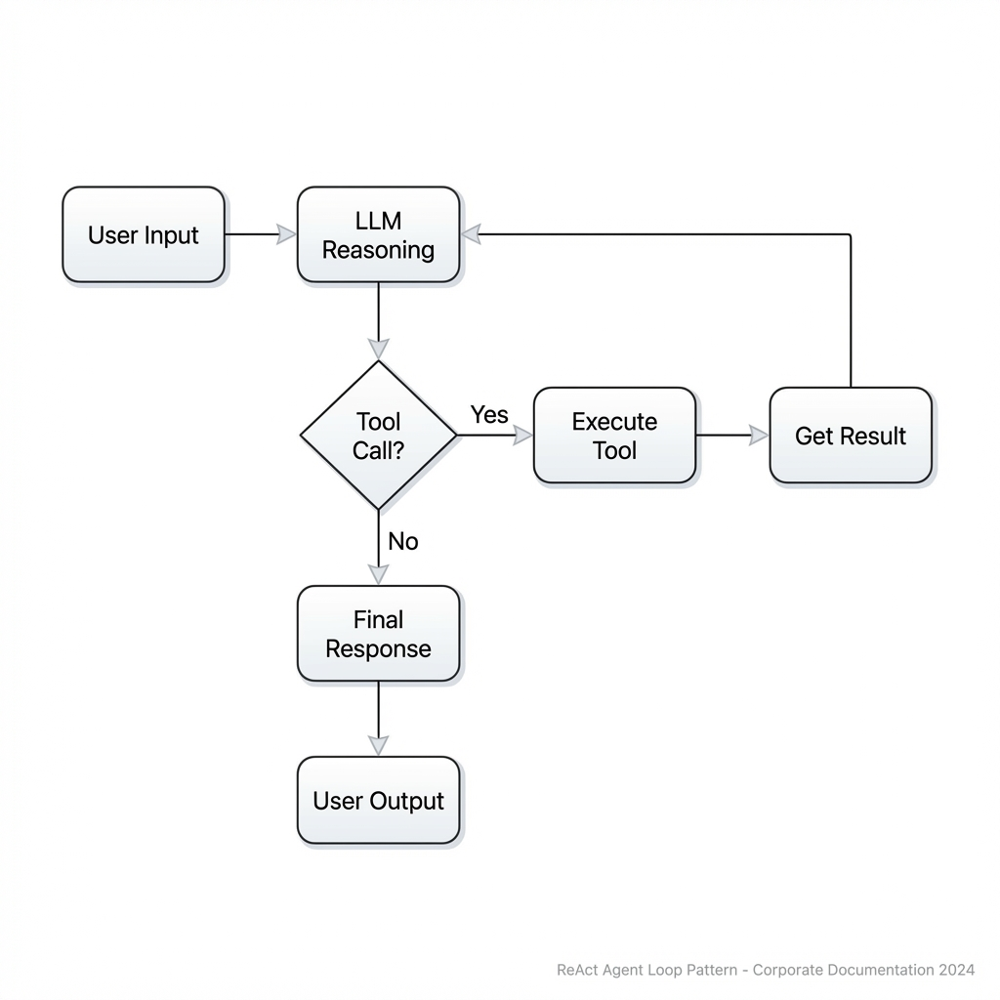
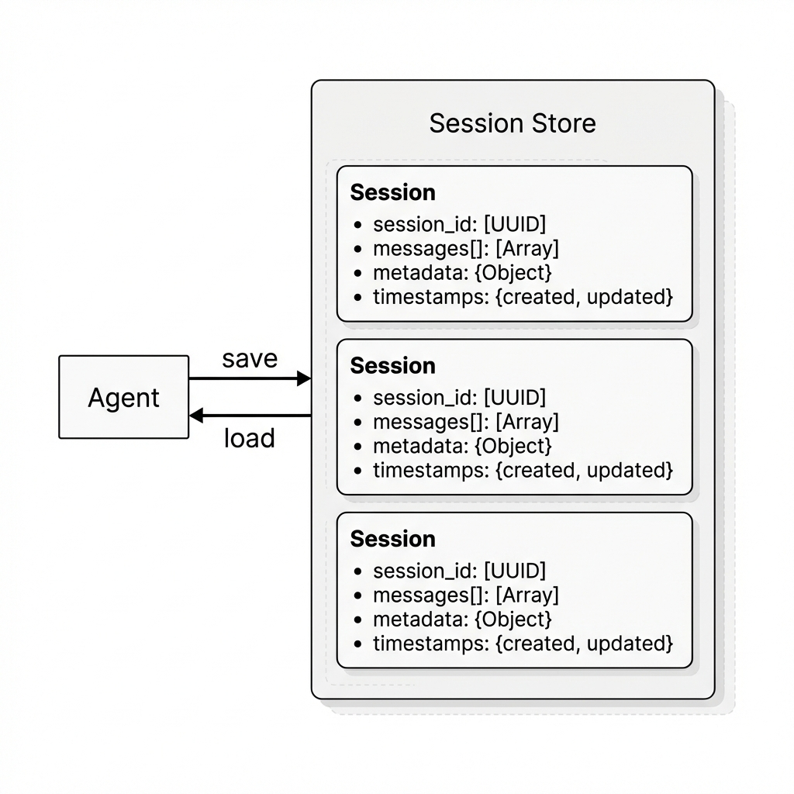
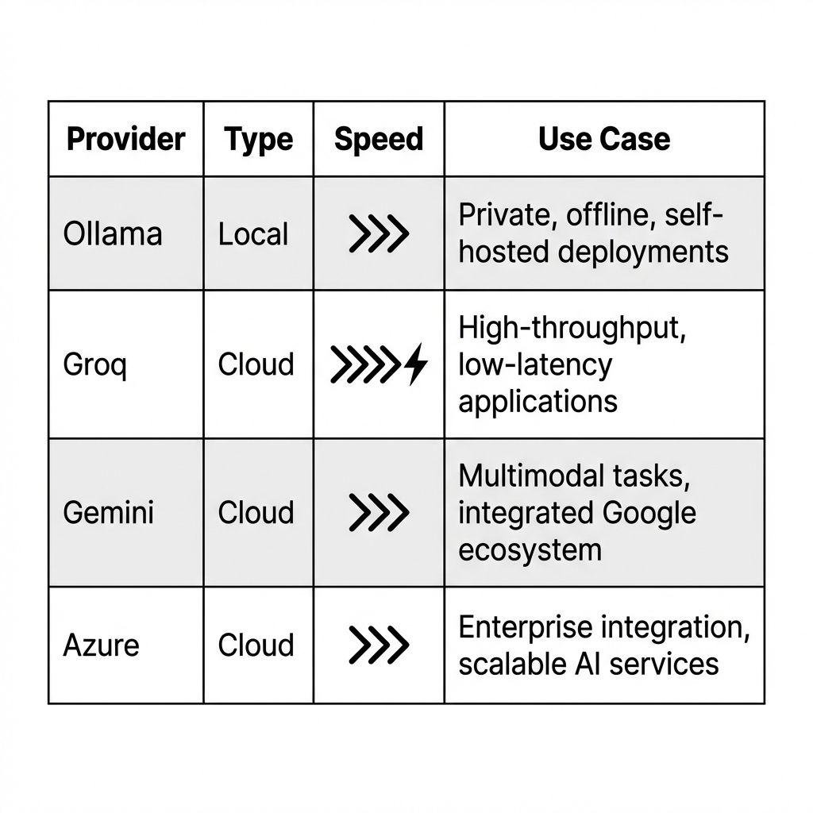

# Core Concepts

Understanding how Agentry agents work under the hood.

## Table of Contents

1. [What is an AI Agent?](#what-is-an-ai-agent)
2. [Architecture Overview](#architecture-overview)
3. [The Agent Loop](#the-agent-loop)
4. [Tools and Function Calling](#tools-and-function-calling)
5. [Session Management](#session-management)
6. [Providers](#providers)
7. [MCP Integration](#mcp-integration)
8. [Understanding the Flow](#understanding-the-flow)
9. [Best Practices](#best-practices)
10. [Next Steps](#next-steps)

---

## What is an AI Agent?

An AI agent is a system that can:

| Capability | Description |
|:-----------|:------------|
| **Perceive** | Receive input from users and environment context |
| **Reason** | Use an LLM to decide what actions to take |
| **Act** | Execute tools and functions to interact with the world |
| **Learn** | Maintain conversation history for context-aware responses |

Unlike a simple chatbot that only generates text, an agent can perform actions such as reading files, searching the web, executing code, and more.

---

## Architecture Overview


The Agentry architecture consists of three main layers:

| Layer | Components | Purpose |
|:------|:-----------|:--------|
| **User Code** | Your Python application | Entry point for agent interactions |
| **Agent Core** | Agent, Session Manager, Tool Manager | Orchestrates LLM calls and tool execution |
| **Provider Layer** | Ollama, Groq, Gemini, Azure | Connects to LLM services |

---

## The Agent Loop

Agentry implements the **ReAct** (Reasoning + Acting) pattern, where the agent iteratively reasons about what to do and takes action.



### Loop Structure

```python
while not done and iterations < max_iterations:
    # Step 1: Send messages to LLM with available tools
    response = await llm.chat(messages, tools=available_tools)
    
    # Step 2: Check if LLM wants to call tools
    if no_tool_calls:
        return response.content  # Final answer
    
    # Step 3: Execute requested tools
    for tool_call in response.tool_calls:
        result = execute_tool(tool_call.name, tool_call.args)
        messages.append({"role": "tool", "content": result})
    
    # Step 4: Loop continues with updated context
```

### Key Characteristics

| Property | Description |
|:---------|:------------|
| **Iterative** | Agent can call multiple tools in sequence |
| **Context-aware** | Each iteration has access to previous results |
| **Bounded** | `max_iterations` prevents infinite loops (default: 20) |
| **Transparent** | Every decision and tool call is traceable |

---

## Tools and Function Calling

Tools are functions that the agent can invoke to interact with external systems.

### Tool Schema Structure


Every tool has a schema that describes it to the LLM:

```python
{
    "type": "function",
    "function": {
        "name": "read_file",
        "description": "Read the contents of a file from the filesystem",
        "parameters": {
            "type": "object",
            "properties": {
                "path": {
                    "type": "string",
                    "description": "Absolute or relative path to the file"
                }
            },
            "required": ["path"]
        }
    }
}
```

### How the LLM Selects Tools

1. LLM receives the user's request
2. LLM examines available tool schemas
3. LLM decides which tool(s) to call
4. LLM generates arguments in JSON format
5. Agent executes the tool and returns results

### Built-in Tool Categories

| Category | Tools | Description |
|:---------|:------|:------------|
| **Filesystem** | `read_file`, `create_file`, `edit_file`, `delete_file`, `list_directory`, `search_files` | File operations |
| **Web** | `web_search`, `fetch_url` | Internet access |
| **Execution** | `run_shell_command`, `execute_python` | Code and command execution |
| **Documents** | PDF, DOCX, PPTX, Excel handlers | Document processing |

### Tool Safety Classification

Agentry classifies tools by risk level:

| Classification | Examples | Behavior |
|:---------------|:---------|:---------|
| **Safe** | `read_file`, `list_directory` | Executes without confirmation |
| **Dangerous** | `delete_file`, `run_shell_command` | Requires user approval |

When a dangerous tool is called:

1. Agent pauses execution
2. Triggers the `on_tool_approval` callback
3. Waits for user confirmation
4. Executes only if approved

---

## Session Management

Sessions maintain conversation context across multiple interactions.



### Why Sessions Matter

Without sessions:

```python
await agent.chat("My name is Alice")
await agent.chat("What's my name?")  # Agent does not remember
```

With sessions:

```python
await agent.chat("My name is Alice", session_id="user_123")
await agent.chat("What's my name?", session_id="user_123")
# Agent responds: "Your name is Alice"
```

### Session Structure

| Field | Type | Description |
|:------|:-----|:------------|
| `session_id` | string | Unique identifier |
| `messages` | array | Full conversation history |
| `metadata` | object | Custom data (timestamps, user info) |
| `created_at` | datetime | When the session started |
| `last_activity` | datetime | Last interaction time |

### Session Persistence

Sessions are saved to disk in `.toon` format:

```python
from agentry.session_manager import SessionManager

manager = SessionManager(storage_dir="./sessions")

# Save session
await manager.save_session(agent.get_session("user_123"))

# Load session
session = await manager.load_session("user_123")
```

For detailed session management, see [Session Management](session-management).

---

## Providers

Providers are adapters that connect Agentry to different LLM services.



### Provider Comparison

| Provider | Type | Best For | API Key |
|:---------|:-----|:---------|:--------|
| **Ollama** | Local | Development, privacy, no API costs | Optional (cloud) |
| **Groq** | Cloud | Speed, production, low latency | Required |
| **Gemini** | Cloud | Google ecosystem, multimodal | Required |
| **Azure** | Cloud | Enterprise, Azure AI Foundry | Required + Endpoint |

### Provider Interface

All providers implement the same interface:

```python
class LLMProvider:
    async def chat(
        self,
        messages: List[Dict],
        tools: Optional[List[Dict]] = None
    ) -> Union[Dict, ChatCompletion]:
        """Send messages and get response with optional tool calls."""
        pass
```

This allows swapping providers without changing code:

```python
# Development (local)
agent = Agent(llm="ollama", model="llama3.2")

# Production (cloud)
agent = Agent(llm="groq", model="llama-3.3-70b-versatile", api_key="...")
```

### Provider-Specific Features

| Provider | Key Features |
|:---------|:-------------|
| **Ollama** | Runs locally, no API key needed, full privacy, custom models |
| **Groq** | Ultra-fast inference (LPU), pay-per-token, limited model selection |
| **Gemini** | Multimodal (images, video), Google AI integration, advanced reasoning |
| **Azure** | Enterprise integration, Azure AI Foundry models including Claude |

---

## MCP Integration

**Model Context Protocol (MCP)** allows Agentry to connect to external tool servers.


### What is MCP?

MCP is a standard protocol for:

- Exposing tools from external services
- Connecting multiple agents to shared tools
- Building modular, composable AI systems

### MCP Configuration

Create an `mcp.json` file in your project:

```json
{
    "mcpServers": {
        "excel": {
            "command": "npx",
            "args": ["-y", "@modelcontextprotocol/server-excel"]
        },
        "filesystem": {
            "command": "npx",
            "args": ["-y", "@modelcontextprotocol/server-filesystem", "/path/to/allowed/directory"]
        }
    }
}
```

### Using MCP in Code

```python
from agentry import Agent

agent = Agent(llm="ollama")
agent.load_default_tools()

# Connect to MCP servers
await agent.add_mcp_server("mcp.json")

# Agent can now use MCP tools
await agent.chat("Read data from sales.xlsx")
```

For detailed MCP usage, see [MCP Integration](mcp-integration).

---

## Understanding the Flow

### High-Level View

```
User Input
    ↓
Agent receives request
    ↓
Agent thinks (LLM reasoning)
    ↓
Agent decides: use tools OR respond
    ↓
If tools: Execute → Get results → Think again
If response: Return to user
```

### Low-Level View

1. User input added to `session.messages`
2. Messages sent to `provider.chat()`
3. Provider calls LLM API with messages and tool schemas
4. LLM returns response (text OR tool_calls)
5. If `tool_calls`:
   - Parse tool name and arguments
   - Check if approval needed
   - Execute tool via `execute_tool()`
   - Add result to `session.messages`
   - Return to step 2
6. If text response:
   - Add to `session.messages`
   - Return to user

---

## Best Practices

### 1. Use Descriptive Tool Names

```python
# Recommended
def calculate_mortgage_payment(principal: float, rate: float, years: int) -> str:
    """Calculate monthly mortgage payment."""
    pass

# Avoid
def calc(p: float, r: float, y: int) -> str:
    """Do calculation."""
    pass
```

### 2. Provide Clear Descriptions

The LLM uses descriptions to decide when to call tools:

```python
# Good description
"Calculate the monthly mortgage payment given principal amount, annual interest rate, and loan term in years"

# Poor description
"Calculate payment"
```

### 3. Handle Errors Gracefully

```python
def my_tool(arg: str) -> str:
    try:
        result = do_something(arg)
        return {"success": True, "data": result}
    except Exception as e:
        return {"success": False, "error": str(e)}
```

### 4. Use Sessions for Context

```python
session_id = "project_123"
await agent.chat("Create a file called app.py", session_id)
await agent.chat("Now add a main function to it", session_id)
# Agent remembers the file from the previous message
```

### 5. Enable Debug Mode During Development

```python
agent = Agent(llm="ollama", debug=True)
# Prints detailed logs of every decision and tool call
```

---

## Next Steps

| Topic | Description |
|:------|:------------|
| [API Reference](api-reference) | Complete API documentation |
| [Custom Tools](custom-tools) | Creating and registering custom tools |
| [Examples](examples) | Practical code examples |
| [MCP Integration](mcp-integration) | Advanced MCP usage |
