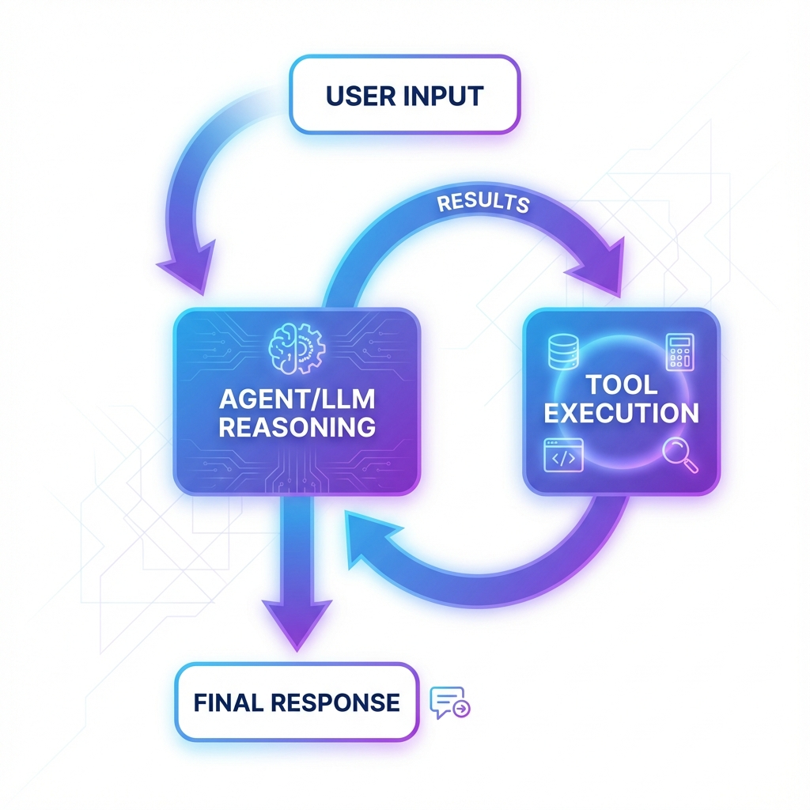

# Getting Started with Agentry

This guide will help you get up and running with Agentry in minutes.

## Installation

### Prerequisites

- Python 3.11 or higher
- One of the following LLM providers:
  - [Ollama](https://ollama.ai/) (local, recommended for development)
  - [Groq](https://groq.com/) API key (cloud, fast)
  - [Gemini](https://ai.google.dev/) API key (Google)

### Install Agentry

```bash
# Clone the repository
git clone https://github.com/RudraModi360/Agentry.git
cd Agentry

# Install dependencies using uv (recommended)
uv sync

# Or using pip
pip install -r requirements.txt
```

### Setup LLM Provider

#### Option 1: Ollama (Local)

```bash
# Install Ollama
# Visit https://ollama.ai/download

# Pull a model
ollama pull gpt-oss:20b

# Or use a specific model
ollama pull gpt-oss:20b-cloud (If you have Ollama API Key)
```

#### Option 2: Groq (Cloud)

```bash
# Get API key from https://console.groq.com/
export GROQ_API_KEY="your-api-key-here"
```

#### Option 3: Gemini (Google)

```bash
# Get API key from https://ai.google.dev/
export GEMINI_API_KEY="your-api-key-here"
```

## Your First Agent



### Basic Agent

Create a file `my_first_agent.py`:

```python
import asyncio
from agentry import Agent

async def main():
    # Initialize agent with Ollama
    agent = Agent(llm="ollama", model="gpt-oss:20b")
    
    # Load default tools (filesystem, web, execution)
    agent.load_default_tools()
    
    # Chat with the agent
    response = await agent.chat("Hello! What can you do?")
    print(response)

if __name__ == "__main__":
    asyncio.run(main())
```

Run it:
```bash
python my_first_agent.py
```

### Interactive Mode

For an interactive chat experience:

```bash
python run_agent.py
```

This starts an interactive session with:
- Session persistence
- Command support (`/help`, `/status`, etc.)
- Auto-save functionality

## Next Steps

- [Learn Core Concepts](core-concepts.md)
- [Explore Examples](examples.md)
- [Create Custom Tools](custom-tools.md)
- [API Reference](api-reference.md)

## Quick Examples

### Using Different Providers

```python
# Groq
agent = Agent(llm="groq", model="llama-3.3-70b-versatile", api_key="...")

# Gemini
agent = Agent(llm="gemini", model="gemini-pro", api_key="...")
```

### Custom System Prompt

```python
agent = Agent(
    llm="ollama",
    system_message="You are a helpful math tutor.",
    role="general"
)
```

### Using CopilotAgent

```python
from agentry import CopilotAgent

copilot = CopilotAgent(llm="ollama")

# Coding task
await copilot.chat("Create a factorial function in Python")

# General chat (different context)
await copilot.general_chat("Tell me a joke")
```

## Troubleshooting

### "Connection refused" error

Make sure Ollama is running:
```bash
ollama serve
```

### "Model not found" error

Pull the model first:
```bash
ollama pull <model-name>
```

### Import errors

Make sure you're in the Agentry directory and dependencies are installed:
```bash
cd Agentry
uv sync  # or pip install -r requirements.txt
```

For more help, see [Troubleshooting Guide](troubleshooting.md).
