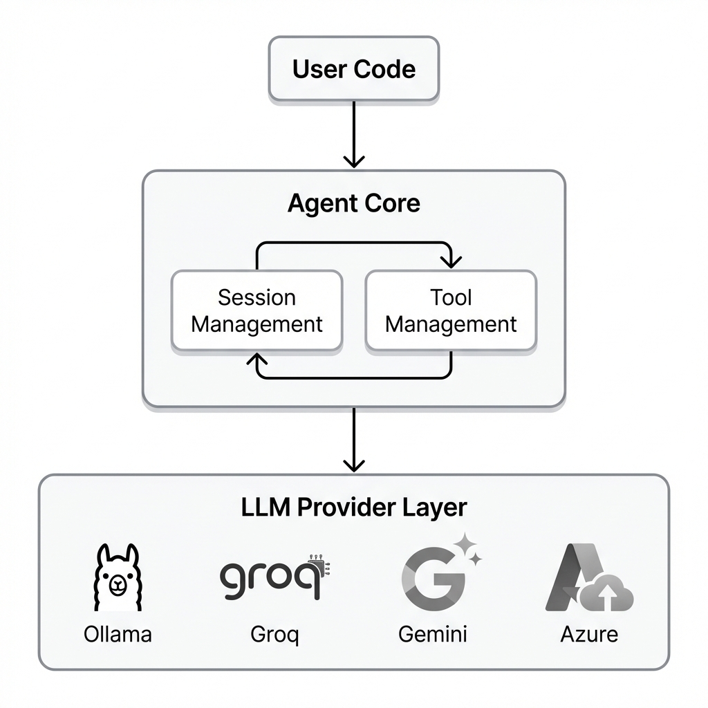

# Agentry

A powerful, modular AI agent framework for Python with multi-provider LLM support, comprehensive built-in tools, and Model Context Protocol (MCP) integration.

[Get Started](getting-started) | [View on GitHub](https://github.com/RudraModi360/Agentry) | [PyPI](https://pypi.org/project/agentry-community/)

---

## Overview

Agentry (published as `agentry_community` on PyPI) provides a unified interface for building AI agents that can reason, use tools, and maintain conversation context. It is designed for flexibility, ease of use, and privacy-focused deployments.

### Key Capabilities

| Feature | Description |
|:--------|:------------|
| **Multi-Provider LLM Support** | Ollama (local/cloud), Groq, Google Gemini, Azure OpenAI |
| **Built-in Tools** | Filesystem operations, web search, code execution, document handling |
| **MCP Integration** | Connect to external tool servers via Model Context Protocol |
| **Session Management** | Automatic persistence and multi-session support |
| **Persistent Memory** | Extract and store insights from conversations |
| **Custom Tools** | Register Python functions as agent tools |
| **Streaming Responses** | Real-time output for improved UX |

---

## Architecture Overview



| Component | Purpose |
|:----------|:--------|
| **Agent** | Core class managing LLM interactions, tool execution, and session handling |
| **Providers** | Adapters connecting to different LLM services (Ollama, Groq, Gemini, Azure) |
| **Tools** | Built-in and custom functions the agent can execute |
| **Session Manager** | Persists conversation history and metadata |
| **MCP Client** | Connects to external MCP servers for additional tools |

---

## Quick Installation

```bash
pip install agentry_community
```

Or from source:

```bash
git clone https://github.com/RudraModi360/Agentry.git
cd Agentry
pip install -e .
```

---

## Quick Start

```python
import asyncio
from agentry import Agent

async def main():
    agent = Agent(llm="ollama", model="llama3.2:3b")
    agent.load_default_tools()
    
    response = await agent.chat("What files are in the current directory?")
    print(response)

if __name__ == "__main__":
    asyncio.run(main())
```

---

## Launch Interfaces

**Command-Line Interface:**
```bash
agentry_cli
```

**Web Interface:**
```bash
agentry_gui
```

---

## Documentation

| Section | Description |
|:--------|:------------|
| [Getting Started](getting-started) | Installation, prerequisites, and first agent |
| [Core Concepts](core-concepts) | Agent loop, tools, sessions, and providers |
| [API Reference](api-reference) | Complete API documentation |
| [Custom Tools](custom-tools) | Creating and registering custom tools |
| [MCP Integration](mcp-integration) | Connecting external tool servers |
| [Session Management](session-management) | Working with persistent sessions |
| [Examples](examples) | Practical code examples |
| [Troubleshooting](troubleshooting) | Common issues and solutions |

---

## Support

- [GitHub Issues](https://github.com/RudraModi360/Agentry/issues) - Report bugs or request features
- [GitHub Discussions](https://github.com/RudraModi360/Agentry/discussions) - Community discussions
- Email: rudramodi9560@gmail.com

---

## License

Agentry is distributed under the [MIT License](https://github.com/RudraModi360/Agentry/blob/main/LICENSE).
