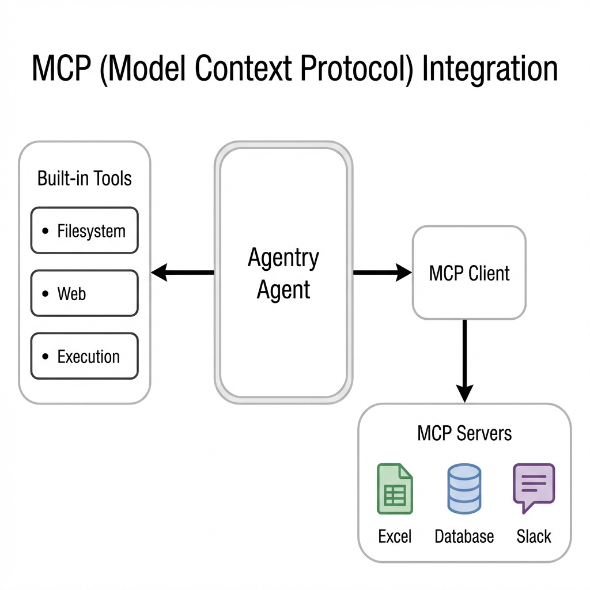

# MCP Integration

Connect Agentry to external tool servers using the Model Context Protocol (MCP).

## Table of Contents

1. [Overview](#overview)
2. [MCP Configuration](#mcp-configuration)
3. [Using MCP in Code](#using-mcp-in-code)
4. [MCPAgent Class](#mcpagent-class)
5. [Practical Examples](#practical-examples)
6. [Available MCP Servers](#available-mcp-servers)
7. [Interactive Commands](#interactive-commands)
8. [Best Practices](#best-practices)
9. [Comparison: Standard Agent vs MCPAgent](#comparison-standard-agent-vs-mcpagent)
10. [Troubleshooting](#troubleshooting)
11. [Next Steps](#next-steps)

---

## Overview

The **Model Context Protocol (MCP)** is a standardized protocol for connecting AI agents to external tool servers. It allows you to:

- Extend agent capabilities with external services
- Share tools across multiple agents
- Integrate with third-party MCP-compatible servers
- Build modular, composable AI systems



---

## MCP Configuration

### Configuration File Structure

Create an `mcp.json` file in your project root:

```json
{
    "mcpServers": {
        "server_name": {
            "command": "executable",
            "args": ["arg1", "arg2"],
            "env": {
                "ENV_VAR": "value"
            }
        }
    }
}
```

**Configuration Fields:**

| Field | Type | Required | Description |
|:------|:-----|:---------|:------------|
| `mcpServers` | object | Yes | Container for server definitions |
| `server_name` | string | Yes | Unique identifier for the server |
| `command` | string | Yes | Executable command to run |
| `args` | array | No | Command-line arguments |
| `env` | object | No | Environment variables |

---

### Example Configurations

#### Excel Server

```json
{
    "mcpServers": {
        "excel": {
            "command": "npx",
            "args": ["-y", "@modelcontextprotocol/server-excel"]
        }
    }
}
```

#### Filesystem Server

```json
{
    "mcpServers": {
        "filesystem": {
            "command": "npx",
            "args": [
                "-y",
                "@modelcontextprotocol/server-filesystem",
                "/path/to/allowed/directory"
            ]
        }
    }
}
```

#### Multiple Servers

```json
{
    "mcpServers": {
        "excel": {
            "command": "npx",
            "args": ["-y", "@modelcontextprotocol/server-excel"]
        },
        "filesystem": {
            "command": "npx",
            "args": ["-y", "@modelcontextprotocol/server-filesystem", "./data"]
        },
        "database": {
            "command": "python",
            "args": ["-m", "mcp_server_sqlite", "--db", "mydata.db"]
        }
    }
}
```

---

## Using MCP in Code

### Basic Usage

```python
import asyncio
from agentry import Agent

async def main():
    agent = Agent(llm="ollama", model="llama3.2")
    agent.load_default_tools()
    
    # Connect to MCP servers
    await agent.add_mcp_server("mcp.json")
    
    # Agent can now use MCP tools
    response = await agent.chat("Read data from sales.xlsx and summarize it")
    print(response)
    
    # Clean up MCP connections
    await agent.cleanup()

asyncio.run(main())
```

### Connecting Multiple Configuration Files

```python
await agent.add_mcp_server("mcp_excel.json")
await agent.add_mcp_server("mcp_database.json")
await agent.add_mcp_server("mcp_custom.json")
```

---

## MCPAgent Class

The `MCPAgent` class provides enhanced multi-session support for MCP-based applications.

### Initialization

```python
from agentry.agents.agent_mcp import MCPAgent
from agentry.providers import OllamaProvider

provider = OllamaProvider(model="llama3.2")

agent = MCPAgent(
    provider=provider,
    debug=True,
    max_iterations=20,
    session_timeout=3600
)
```

**Parameters:**

| Parameter | Type | Default | Description |
|:----------|:-----|:--------|:------------|
| `provider` | LLMProvider | Required | LLM provider instance |
| `system_message` | str | None | Default system message |
| `debug` | bool | False | Enable debug output |
| `max_iterations` | int | 20 | Maximum tool call iterations |
| `session_timeout` | int | 3600 | Session timeout in seconds |

---

### Session Management

#### Creating Sessions

```python
agent.create_session(
    session_id="customer_123",
    system_message="You are a helpful customer support agent.",
    metadata={"customer_id": "123", "tier": "premium"}
)
```

#### Getting Sessions

```python
session = agent.get_session("customer_123")
if session:
    print(f"Session has {len(session.messages)} messages")
```

#### Destroying Sessions

```python
agent.destroy_session("customer_123")
```

#### Listing All Sessions

```python
sessions = agent.list_sessions()
for session in sessions:
    print(f"{session['session_id']}: {session['message_count']} messages")
```

#### Cleaning Up Stale Sessions

```python
cleaned = agent.cleanup_stale_sessions()
print(f"Cleaned up {cleaned} stale sessions")
```

---

### Chat Operations

```python
response = await agent.chat(
    "What's the weather like?",
    session_id="user_123",
    create_if_missing=True
)
```

**Parameters:**

| Parameter | Type | Default | Description |
|:----------|:-----|:--------|:------------|
| `user_input` | str | Required | User message |
| `session_id` | str | "default" | Session identifier |
| `create_if_missing` | bool | True | Create session if it doesn't exist |

---

### Tool Schema Export

Export MCP-compatible tool schemas:

```python
# Get tool schemas
tools = MCPAgent.list_mcp_tools_schema()
for tool in tools:
    print(f"{tool['name']}: {tool['description']}")
    print(f"  Dangerous: {tool['dangerous']}")
    print(f"  Requires Approval: {tool['requires_approval']}")

# Export to file
agent.export_mcp_config("config/mcp_tools.json")
```

**Export Format:**

```json
{
    "version": "1.0",
    "tools": [...],
    "metadata": {
        "provider": "OllamaProvider",
        "max_iterations": 20,
        "session_timeout": 3600
    }
}
```

---

### Callbacks

#### Tool Callbacks

```python
def on_tool_start(session_id, tool_name, args):
    print(f"[{session_id}] Starting {tool_name}")

def on_tool_end(session_id, tool_name, result):
    print(f"[{session_id}] Finished {tool_name}")

async def on_tool_approval(session_id, tool_name, args):
    return input(f"Approve {tool_name}? (y/n): ") == 'y'

def on_final_message(session_id, message):
    print(f"[{session_id}] {message}")

agent.set_tool_callbacks(
    on_tool_start=on_tool_start,
    on_tool_end=on_tool_end,
    on_tool_approval=on_tool_approval,
    on_final_message=on_final_message
)
```

#### Session Callbacks

```python
def on_session_created(session_id):
    print(f"Session {session_id} created")

def on_session_destroyed(session_id):
    print(f"Session {session_id} destroyed")

agent.set_session_callbacks(
    on_session_created=on_session_created,
    on_session_destroyed=on_session_destroyed
)
```

---

## Practical Examples

### Multi-User Application

```python
import asyncio
from agentry.agents.agent_mcp import MCPAgent
from agentry.providers import GroqProvider

async def handle_user_message(agent, user_id, message):
    session_id = f"user_{user_id}"
    
    if not agent.get_session(session_id):
        agent.create_session(
            session_id,
            metadata={"user_id": user_id}
        )
    
    response = await agent.chat(message, session_id=session_id)
    return response

async def main():
    provider = GroqProvider(
        model="llama-3.3-70b-versatile",
        api_key="your-api-key"
    )
    agent = MCPAgent(provider, session_timeout=1800)
    
    # Handle messages from multiple users concurrently
    users = ["alice", "bob", "charlie"]
    
    tasks = [
        handle_user_message(agent, user, f"Hello from {user}!")
        for user in users
    ]
    
    responses = await asyncio.gather(*tasks)
    
    for user, response in zip(users, responses):
        print(f"{user}: {response}")

asyncio.run(main())
```

### Context Switching

```python
async def context_switching():
    provider = OllamaProvider(model="llama3.2")
    agent = MCPAgent(provider)
    
    # Create specialized contexts
    agent.create_session(
        "coding",
        system_message="You are a senior software engineer."
    )
    
    agent.create_session(
        "writing",
        system_message="You are a creative writing assistant."
    )
    
    # Switch between contexts seamlessly
    await agent.chat("Write a Python quicksort function", session_id="coding")
    await agent.chat("Write a haiku about programming", session_id="writing")
    await agent.chat("Now optimize the function", session_id="coding")
```

### Session Monitoring

```python
async def monitor_sessions(agent):
    while True:
        sessions = agent.list_sessions()
        print(f"Active sessions: {len(sessions)}")
        
        for session in sessions:
            print(f"  {session['session_id']}: "
                  f"{session['message_count']} messages, "
                  f"last active: {session['last_activity']}")
        
        cleaned = agent.cleanup_stale_sessions()
        if cleaned > 0:
            print(f"Cleaned up {cleaned} stale sessions")
        
        await asyncio.sleep(300)  # Check every 5 minutes
```

---

## Available MCP Servers

### Official Servers

| Server | Package | Description |
|:-------|:--------|:------------|
| Excel | `@modelcontextprotocol/server-excel` | Read/write Excel files |
| Filesystem | `@modelcontextprotocol/server-filesystem` | File operations |
| SQLite | `mcp-server-sqlite` | SQLite database access |
| PostgreSQL | `mcp-server-postgres` | PostgreSQL database access |

### Installation

Most MCP servers can be installed via npx:

```bash
npx -y @modelcontextprotocol/server-excel
```

Or installed globally:

```bash
npm install -g @modelcontextprotocol/server-excel
```

---

## Interactive Commands

When running in MCP mode via CLI, these commands are available:

| Command | Description | Example |
|:--------|:------------|:--------|
| `/new <id>` | Create new session | `/new customer_123` |
| `/switch <id>` | Switch to session | `/switch customer_123` |
| `/list` | List all sessions | `/list` |
| `/clear` | Clear current session | `/clear` |
| `/export [file]` | Export MCP config | `/export tools.json` |
| `/tools` | Show available tools | `/tools` |
| `/exit` | Exit the agent | `/exit` |

---

## Best Practices

### Session ID Naming

```python
# Good - descriptive and unique
session_id = f"user_{user_id}_{timestamp}"
session_id = f"customer_support_{ticket_id}"

# Avoid - not unique or meaningful
session_id = "session1"
session_id = str(random.randint(1, 1000))
```

### Session Cleanup

```python
async def cleanup_task(agent):
    while True:
        await asyncio.sleep(600)  # Every 10 minutes
        agent.cleanup_stale_sessions()
```

### Metadata Usage

```python
from datetime import datetime

agent.create_session(
    session_id,
    metadata={
        "user_id": user_id,
        "created_at": datetime.now().isoformat(),
        "user_tier": "premium",
        "department": "support"
    }
)
```

### Error Handling

```python
try:
    response = await agent.chat(message, session_id=session_id)
except ValueError as e:
    print(f"Session error: {e}")
    agent.create_session(session_id)
    response = await agent.chat(message, session_id=session_id)
```

---

## Comparison: Standard Agent vs MCPAgent

| Feature | Standard Agent | MCPAgent |
|:--------|:--------------|:---------|
| Sessions | Single | Multiple concurrent |
| Context Isolation | No | Yes |
| Session Management | Basic | Full lifecycle |
| Metadata Support | No | Yes |
| Session Timeout | No | Yes |
| Multi-User Support | No | Yes |
| Tool Schema Export | No | Yes |
| Session Callbacks | No | Yes |

---

## Troubleshooting

### MCP Server Won't Start

```bash
# Check if npx is installed
npx --version

# Test the server manually
npx -y @modelcontextprotocol/server-excel

# Check mcp.json syntax
cat mcp.json | python -m json.tool
```

### MCP Tools Not Available

```python
# Verify connection
await agent.add_mcp_server("mcp.json")

# Check loaded tools
tools = await agent.get_all_tools()
mcp_tools = [t for t in tools if 'mcp' in t.get('source', '')]
print(mcp_tools)
```

### Memory Issues

```python
# Use aggressive timeout
agent = MCPAgent(provider, session_timeout=600)

# Run cleanup frequently
agent.cleanup_stale_sessions()
```

---

## Next Steps

| Topic | Description |
|:------|:------------|
| [Custom Tools](custom-tools) | Creating your own tools |
| [Session Management](session-management) | Advanced session handling |
| [Examples](examples) | MCP-related code examples |
| [API Reference](api-reference) | Complete API documentation |
