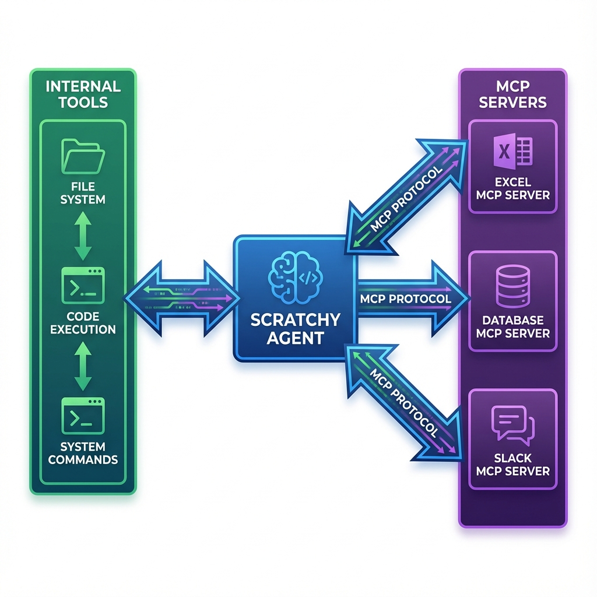

# Multi-Context Prompting (MCP) Agent

## Overview

The **MCPAgent** is an enhanced AI agent implementation that supports **Multi-Context Prompting** with session management capabilities. This allows you to manage multiple concurrent conversations with isolated contexts, making it ideal for:

- **Multi-user applications** - Each user gets their own session
- **Context switching** - Maintain different conversation contexts simultaneously
- **Session persistence** - Track and manage conversation history per session
- **Production deployments** - Built-in session timeout and cleanup mechanisms



---

## Key Features

### 🎯 Multi-Session Management
- Create and manage multiple concurrent conversation sessions
- Each session has isolated message history and context
- Session metadata support for custom tracking
- Automatic session timeout and cleanup

### 🛠️ MCP-Compatible Tool Schema
- Generate standardized tool definitions
- Export tool configurations in MCP format
- Tool safety classification (safe, moderate, dangerous)
- Approval workflow integration

### 🔄 Enhanced Callbacks
- Session-aware callbacks for all events
- Tool execution tracking per session
- Session lifecycle events (created, destroyed)
- Fine-grained control over agent behavior

### 📊 Session Monitoring
- List all active sessions
- Get session summaries with metadata
- Track message counts and activity timestamps
- Export session statistics

---

## Quick Start

### Basic Usage

```python
import asyncio
from providers.ollama_provider import OllamaProvider
from agents.agent_mcp import MCPAgent

async def main():
    # Initialize provider
    provider = OllamaProvider(model="gpt-oss:20b-cloud")
    
    # Create MCP agent
    agent = MCPAgent(provider, debug=True)
    
    # Create a session
    agent.create_session("user_123")
    
    # Chat in the session
    response = await agent.chat(
        "Hello! What can you help me with?",
        session_id="user_123"
    )
    
    print(response)

asyncio.run(main())
```

### Interactive Mode

Run the agent in MCP mode from the command line:

```bash
python src/main.py
# Select mode: 2 (MCP Agent)
# Select provider: 1 (Ollama)
```

---

## Architecture

### ClientSession Class

Each session is represented by a `ClientSession` object:

```python
class ClientSession:
    session_id: str              # Unique session identifier
    messages: List[Dict]         # Conversation history
    created_at: datetime         # Session creation time
    last_activity: datetime      # Last interaction time
    metadata: Dict[str, Any]     # Custom metadata
```

### MCPAgent Class

The main agent class with multi-context support:

```python
class MCPAgent:
    provider: LLMProvider        # LLM provider (Ollama, Groq, Gemini)
    sessions: Dict[str, ClientSession]  # Active sessions
    max_iterations: int          # Max tool call iterations
    session_timeout: int         # Session timeout in seconds
```

---

## API Reference

### Session Management

#### `create_session(session_id, system_message=None, metadata=None)`

Create a new conversation session.

```python
agent.create_session(
    session_id="customer_123",
    system_message="You are a helpful customer support agent.",
    metadata={"customer_id": "123", "tier": "premium"}
)
```

**Parameters:**
- `session_id` (str): Unique identifier for the session
- `system_message` (str, optional): Custom system prompt
- `metadata` (dict, optional): Custom metadata to attach

**Returns:** `ClientSession` object

**Raises:** `ValueError` if session already exists

---

#### `get_session(session_id)`

Retrieve an existing session.

```python
session = agent.get_session("customer_123")
if session:
    print(f"Session has {len(session.messages)} messages")
```

**Returns:** `ClientSession` or `None` if not found

---

#### `destroy_session(session_id)`

Remove a session and clean up resources.

```python
agent.destroy_session("customer_123")
```

**Returns:** `bool` - True if session was destroyed, False if not found

---

#### `list_sessions()`

Get summaries of all active sessions.

```python
sessions = agent.list_sessions()
for session in sessions:
    print(f"{session['session_id']}: {session['message_count']} messages")
```

**Returns:** List of session summary dictionaries

---

#### `cleanup_stale_sessions()`

Remove sessions that have exceeded the timeout period.

```python
cleaned = agent.cleanup_stale_sessions()
print(f"Cleaned up {cleaned} stale sessions")
```

**Returns:** `int` - Number of sessions cleaned up

---

### Chat Operations

#### `chat(user_input, session_id="default", create_if_missing=True)`

Process a message within a specific session.

```python
response = await agent.chat(
    "What's the weather like?",
    session_id="user_123",
    create_if_missing=True
)
```

**Parameters:**
- `user_input` (str): The user's message
- `session_id` (str): Session identifier (default: "default")
- `create_if_missing` (bool): Create session if it doesn't exist

**Returns:** `str` - Final assistant response or `None` if max iterations reached

---

#### `get_session_history(session_id)`

Get the full message history for a session.

```python
history = agent.get_session_history("user_123")
for msg in history:
    print(f"{msg['role']}: {msg['content']}")
```

**Returns:** List of message dictionaries or `None`

---

#### `clear_session_history(session_id, keep_system=True)`

Clear conversation history for a session.

```python
agent.clear_session_history("user_123", keep_system=True)
```

**Parameters:**
- `session_id` (str): Session to clear
- `keep_system` (bool): Whether to keep system message

**Returns:** `bool` - Success status

---

### Tool Schema Management

#### `list_mcp_tools_schema()` (static method)

Generate MCP-compatible tool schemas.

```python
tools = MCPAgent.list_mcp_tools_schema()
for tool in tools:
    print(f"{tool['name']}: {tool['description']}")
    print(f"  Dangerous: {tool['dangerous']}")
    print(f"  Requires Approval: {tool['requires_approval']}")
```

**Returns:** List of tool definition dictionaries

---

#### `export_mcp_config(filepath="mcp_tools.json")`

Export MCP configuration to a JSON file.

```python
agent.export_mcp_config("config/mcp_tools.json")
```

**Parameters:**
- `filepath` (str): Output file path

**Output Format:**
```json
{
  "version": "1.0",
  "tools": [...],
  "metadata": {
    "provider": "OllamaProvider",
    "max_iterations": 20,
    "session_timeout": 3600
  }
}
```

---

### Callbacks

#### `set_tool_callbacks(...)`

Set callbacks for tool execution events.

```python
def on_tool_start(session_id, tool_name, args):
    print(f"[{session_id}] Starting {tool_name}")

def on_tool_end(session_id, tool_name, result):
    print(f"[{session_id}] Finished {tool_name}")

async def on_tool_approval(session_id, tool_name, args):
    return input(f"Approve {tool_name}? (y/n): ") == 'y'

def on_final_message(session_id, message):
    print(f"[{session_id}] {message}")

agent.set_tool_callbacks(
    on_tool_start=on_tool_start,
    on_tool_end=on_tool_end,
    on_tool_approval=on_tool_approval,
    on_final_message=on_final_message
)
```

---

#### `set_session_callbacks(...)`

Set callbacks for session lifecycle events.

```python
def on_session_created(session_id):
    print(f"Session {session_id} created")

def on_session_destroyed(session_id):
    print(f"Session {session_id} destroyed")

agent.set_session_callbacks(
    on_session_created=on_session_created,
    on_session_destroyed=on_session_destroyed
)
```

---

## Usage Examples

### Example 1: Multi-User Chat Application

```python
import asyncio
from agents.agent_mcp import MCPAgent
from providers.groq_provider import GroqProvider

async def handle_user_message(agent, user_id, message):
    """Handle a message from a specific user."""
    session_id = f"user_{user_id}"
    
    # Create session if first message
    if not agent.get_session(session_id):
        agent.create_session(
            session_id,
            metadata={"user_id": user_id}
        )
    
    # Process message
    response = await agent.chat(message, session_id=session_id)
    return response

async def main():
    provider = GroqProvider(model="llama-3.3-70b-versatile")
    agent = MCPAgent(provider, session_timeout=1800)
    
    # Simulate multiple users
    users = ["alice", "bob", "charlie"]
    
    tasks = [
        handle_user_message(agent, user, f"Hello from {user}!")
        for user in users
    ]
    
    responses = await asyncio.gather(*tasks)
    
    for user, response in zip(users, responses):
        print(f"{user}: {response}")

asyncio.run(main())
```

---

### Example 2: Context Switching

```python
async def demo_context_switching():
    provider = OllamaProvider(model="gpt-oss:20b-cloud")
    agent = MCPAgent(provider)
    
    # Create different contexts
    agent.create_session(
        "coding",
        system_message="You are a senior software engineer."
    )
    
    agent.create_session(
        "writing",
        system_message="You are a creative writing assistant."
    )
    
    # Switch between contexts
    await agent.chat(
        "Write a Python function for quicksort",
        session_id="coding"
    )
    
    await agent.chat(
        "Write a short poem about the ocean",
        session_id="writing"
    )
    
    # Each session maintains its own context
    await agent.chat(
        "Now optimize it for performance",
        session_id="coding"  # Continues coding conversation
    )
```

---

### Example 3: Session Monitoring

```python
async def monitor_sessions(agent):
    """Periodically monitor and clean up sessions."""
    while True:
        # List active sessions
        sessions = agent.list_sessions()
        print(f"Active sessions: {len(sessions)}")
        
        for session in sessions:
            print(f"  {session['session_id']}: "
                  f"{session['message_count']} messages, "
                  f"last active: {session['last_activity']}")
        
        # Clean up stale sessions
        cleaned = agent.cleanup_stale_sessions()
        if cleaned > 0:
            print(f"Cleaned up {cleaned} stale sessions")
        
        await asyncio.sleep(300)  # Check every 5 minutes
```

---

## Interactive Commands

When running in MCP mode, the following commands are available:

| Command | Description | Example |
|---------|-------------|---------|
| `/new <id>` | Create new session | `/new customer_123` |
| `/switch <id>` | Switch to session | `/switch customer_123` |
| `/list` | List all sessions | `/list` |
| `/clear` | Clear current session | `/clear` |
| `/export [file]` | Export MCP config | `/export tools.json` |
| `/tools` | Show available tools | `/tools` |
| `/exit` or `/quit` | Exit the agent | `/quit` |

---

## Configuration

### Initialization Parameters

```python
agent = MCPAgent(
    provider=provider,              # LLM provider instance
    system_message="...",           # Default system message
    debug=False,                    # Enable debug output
    max_iterations=20,              # Max tool call iterations
    session_timeout=3600            # Session timeout (seconds)
)
```

### Environment Variables

The MCP agent uses the same environment variables as the standard agent:

```bash
# For Groq
GROQ_API_KEY=your_groq_key

# For Gemini
GEMINI_API_KEY=your_gemini_key

# For Ollama (optional)
OLLAMA_HOST=http://localhost:11434
```

---

## Best Practices

### 1. Session ID Naming

Use meaningful, unique session IDs:

```python
# Good
session_id = f"user_{user_id}_{timestamp}"
session_id = f"customer_support_{ticket_id}"

# Avoid
session_id = "session1"
session_id = str(random.randint(1, 1000))
```

### 2. Session Cleanup

Regularly clean up stale sessions in production:

```python
# Run cleanup periodically
async def cleanup_task(agent):
    while True:
        await asyncio.sleep(600)  # Every 10 minutes
        agent.cleanup_stale_sessions()
```

### 3. Metadata Usage

Use metadata for tracking and analytics:

```python
agent.create_session(
    session_id,
    metadata={
        "user_id": user_id,
        "created_at": datetime.now().isoformat(),
        "user_tier": "premium",
        "department": "support"
    }
)
```

### 4. Error Handling

Always handle session-related errors:

```python
try:
    response = await agent.chat(message, session_id=session_id)
except ValueError as e:
    print(f"Session error: {e}")
    # Create session or handle appropriately
```

---

## Comparison: Standard vs MCP Agent

| Feature | Standard Agent | MCP Agent |
|---------|---------------|-----------|
| **Sessions** | Single | Multiple concurrent |
| **Context Isolation** | ❌ | ✅ |
| **Session Management** | ❌ | ✅ |
| **Metadata Support** | ❌ | ✅ |
| **Session Timeout** | ❌ | ✅ |
| **Multi-User Support** | ❌ | ✅ |
| **Tool Schema Export** | ❌ | ✅ |
| **Session Callbacks** | ❌ | ✅ |

---

## Troubleshooting

### Session Not Found

```python
# Always check if session exists
session = agent.get_session(session_id)
if not session:
    agent.create_session(session_id)
```

### Memory Issues with Many Sessions

```python
# Set aggressive timeout for high-traffic scenarios
agent = MCPAgent(
    provider,
    session_timeout=600  # 10 minutes
)

# Run cleanup more frequently
agent.cleanup_stale_sessions()
```

### Tool Approval Blocking

```python
# For automated scenarios, skip approval
agent.on_tool_approval = None  # Auto-approve all tools

# Or implement custom logic
async def smart_approval(session_id, tool_name, args):
    # Auto-approve safe tools
    if tool_name in SAFE_TOOLS:
        return True
    # Require approval for others
    return await ask_user_approval(session_id, tool_name, args)
```

---

## Advanced Topics

### Custom Session Storage

Extend `ClientSession` for database persistence:

```python
class DatabaseSession(ClientSession):
    def __init__(self, session_id, system_message, db_connection):
        super().__init__(session_id, system_message)
        self.db = db_connection
    
    def add_message(self, message):
        super().add_message(message)
        self.db.save_message(self.session_id, message)
```

### Session Migration

Move sessions between agent instances:

```python
# Export session
session = agent1.get_session("user_123")
session_data = {
    "session_id": session.session_id,
    "messages": session.messages,
    "metadata": session.metadata
}

# Import to new agent
agent2.create_session(
    session_data["session_id"],
    metadata=session_data["metadata"]
)
for msg in session_data["messages"]:
    agent2.sessions[session_data["session_id"]].add_message(msg)
```

---

## See Also

- [Standard Agent Documentation](../README.md#-usage)
- [Tool Development Guide](../README.md#-configuration)
- [Provider Setup](../README.md#-prerequisites)
- [Examples](../examples/mcp_agent_example.py)

---

**Built with ❤️ for the Agentry Framework**
